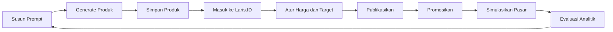

<div align="center">

# BRIDA — Ventra

### Belajar membangun produk digital melalui simulasi bisnis yang interaktif.

[](https://unity.com/)
[](https://learn.microsoft.com/dotnet/csharp/)
[](#status-pengembangan)
[](#tim-pengembang)

<p>
  <a href="#tentang-game">Tentang</a> •
  <a href="#fitur-utama">Fitur</a> •
  <a href="#alur-permainan">Alur</a> •
  <a href="#menjalankan-project">Menjalankan Project</a> •
  <a href="#tim-pengembang">Tim</a>
</p>

</div>

---

## Tentang Game

**BRIDA — Ventra** adalah game edukasi berbasis simulasi yang mengajak pemain mempelajari proses membangun bisnis produk digital.

Pemain tidak hanya membuat sebuah produk, tetapi juga harus menentukan konsep yang tepat, memahami target pasar, menetapkan harga, melakukan promosi, membaca performa penjualan, dan mengembangkan reputasi toko.

Project ini dirancang untuk memperkenalkan pola pikir kreatif dan kewirausahaan digital melalui mekanik permainan yang sederhana, visual, dan mudah dipahami.

> Dari sebuah ide, menjadi produk, lalu berkembang menjadi bisnis digital.

## Tujuan Pembelajaran

- Melatih pemain menyusun ide produk yang relevan dan konsisten.
- Mengenalkan hubungan antara kualitas produk, target pasar, dan harga.
- Mengajarkan bahwa promosi meningkatkan jangkauan, tetapi tidak selalu menjamin penjualan.
- Membantu pemain membaca tayangan, klik, konversi, rating, dan pendapatan.
- Mendorong pemain mengevaluasi strategi dan mencoba pendekatan yang berbeda.

## Fitur Utama

### ProdukLM

Aplikasi simulasi pembuatan produk digital di dalam game.

- **Prompt Builder berbasis kartu** untuk menyusun jenis produk, tujuan, audiens, konten, gaya, dan optimasi.
- Sistem **Affinity, Cross Connection, dan Conflict** untuk menilai hubungan antar pilihan.
- Hasil produk memiliki statistik **Quality, Relevansi, dan Nilai Jual**.
- Pilihan model **AI Free, AI Plus, dan AI Pro** dengan kualitas serta limit harian berbeda.
- Sistem upgrade AI menggunakan saldo hasil bisnis pemain.
- Hasil generate dapat disimpan sebagai produk digital dan dikirim ke library Laris.ID.
- Dukungan ikon file seperti PDF, dokumen, presentasi, gambar, dan tipe produk lainnya.

### Laris.ID

Marketplace digital fiktif tempat pemain mengelola dan menjual produk.

- Dashboard toko berisi saldo, pengikut, rating, penjualan, pendapatan, dan tren aktif.
- Produk memiliki status **Draft, Active, dan Archived**.
- Harga pasar berbeda berdasarkan jenis produk dan statistik hasil ProdukLM.
- Level toko **Pemula, Berkembang, dan Terkenal** membuka rentang harga baru.
- Simulasi pasar harian menghasilkan tayangan, klik, pembelian, ulasan, dan pengikut.
- Sistem tren kategori yang memberikan bonus permintaan pasar.
- Rating dan ulasan dipengaruhi oleh kualitas serta kesesuaian produk.
- Halaman analitik untuk mengevaluasi performa toko dan produk.

### Promosi Kreator

- Pemain dapat memilih produk aktif yang ingin dipromosikan.
- Tersedia **6–8 penawaran promotor berbeda setiap hari**.
- Promotor berasal dari platform **YouTube, Instagram, dan TikTok**.
- Setiap promotor memiliki biaya, durasi, dan estimasi kenaikan tayangan berbeda.
- Promosi meningkatkan jangkauan produk tanpa menjamin pembelian.

### Desktop Terintegrasi

ProdukLM dan Laris.ID dapat dijalankan melalui sebuah desktop virtual sederhana. Sistem ini menjadi dasar integrasi kedua aplikasi ke tampilan laptop utama di dalam game.

## Alur Permainan



## Teknologi

| Komponen | Teknologi |
|---|---|
| Game Engine | Unity `6000.4.10f1` |
| Bahasa | C# |
| UI | Unity UI, TextMesh Pro |
| Input | Unity Input System |
| Arsitektur | Data, mekanik, dan UI dipisahkan secara modular |

## Menjalankan Project

1. Clone repository ini.
2. Buka **Unity Hub**.
3. Tambahkan folder `Babulu City` sebagai project.
4. Gunakan Unity `6000.4.10f1` atau versi yang kompatibel.
5. Buka salah satu scene testing:

   - `Assets/Project/Scenes/ProdukLM_LarisID_Test.unity`
   - `Assets/Project/Scenes/LarisID_Test.unity`
   - `Assets/Project/Scenes/ProdukLM Test.unity`

6. Tekan **Play** untuk menjalankan simulasi.

> Nama produk sudah berganti menjadi **Ventra**, tetapi folder project Unity di disk masih bernama `Babulu City`. Path pada dokumen ini sengaja ditulis apa adanya agar tetap bisa diikuti.

## Struktur Singkat

```text
Babulu City/
├── Assets/
│   └── Project/
│       ├── Scenes/
│       ├── Prefabs/
│       └── Scripts/
│           └── App/
│               ├── ProdukLM/
│               ├── LarisID/
│               └── Integration/
├── Packages/
└── ProjectSettings/
```

## Status Pengembangan

Project masih berada pada tahap **prototype dan pengujian mekanik**. Tampilan saat ini belum mewakili desain final.

Fokus pengembangan sementara:

- Menstabilkan alur ProdukLM menuju Laris.ID.
- Menyeimbangkan kualitas produk, harga, penjualan, dan progres pemain.
- Mengembangkan UI final untuk laptop di dalam game.
- Menambahkan penyimpanan data permanen dan integrasi sistem game utama.

## Tim Pengembang

Project ini dikerjakan bersama oleh:

| | Nama |
|---:|---|
| 01 | **Ibnu** |
| 02 | **Tama** |
| 03 | **Alifa** |
| 04 | **Rizal** |
| 05 | **Diren** |

---

<div align="center">

**BRIDA — Ventra**

*Made by Man Insan Cendekia Students*

</div>
